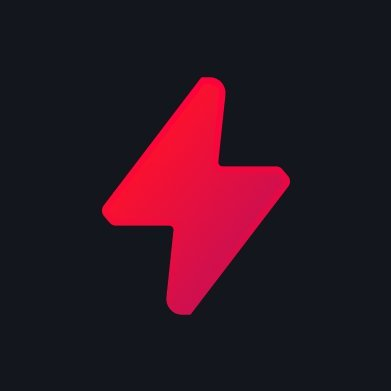

# 🚀 Suyank Saraswat
**`Full-time Frontend Explorer & Occasional Developer`** 

## About Me
- I build, ship, and scale impactful products using modern technologies
- 6+ years of experience across consumer goods, analytics, legal tech, fin-tech, and ed-tech
- Passionate about AI/LLMs, React ecosystem, and building innovative solutions
- Currently working as Product Architect at CodeRabbit, building design systems and AI-powered tools

## Skill Stack
<!-- Skill icons provided by skill-icons. Full icon list and names:
     https://github.com/tandpfun/skill-icons?tab=readme-ov-file#icons-list -->

**Also comfortable with**: React Native, Web3, Smart Contracts, CI/CD pipelines, and modern development workflows.

---

## Featured Contributions

<table>
  <tr>
    <td align="center" width="33%">
      
       
      <b>Flowpad (Langware)</b> 
      AI integration app for orgs with agentic capabilities for workspace management. Built custom monorepo architecture with shared design system. 
      🔗 <a href="https://flowpad.ai">Live Demo</a>
       
      Tags: React, Vite, TypeScript, AI, Monorepo
    </td>
    <td align="center" width="33%">
      
       
      <b>Segwise Analytics</b> 
      Growth analytics platform that helped secure funding. Built with Next.js, GoLang, TypeScript, AWS, and Mixpanel. 
      🔗 <a href="https://www.segwise.ai">Live Demo</a>
       
      Tags: Next.js, TypeScript, GoLang, AWS, Analytics
    </td>
    <td align="center" width="33%">
      
       
      <b>Blitz</b> 
      Led development of Blitz's app using Electron and React, supporting major titles like Valorant and League of Legends. 
      🔗 <a href="https://blitz.gg">Live Demo</a>
       
      Tags: Electron, React, Game Analytics, Riot APIs
    </td>
  </tr>
</table>

---

## Stats

---

## Links
- [**Portfolio**](https://suyanksaraswat.vercel.app)
- [**Contact**](mailto:suyank.saraswat@gmail.com)

---

## Recent Activity

---

*"Building the future, one line of code at a time."* 🚀